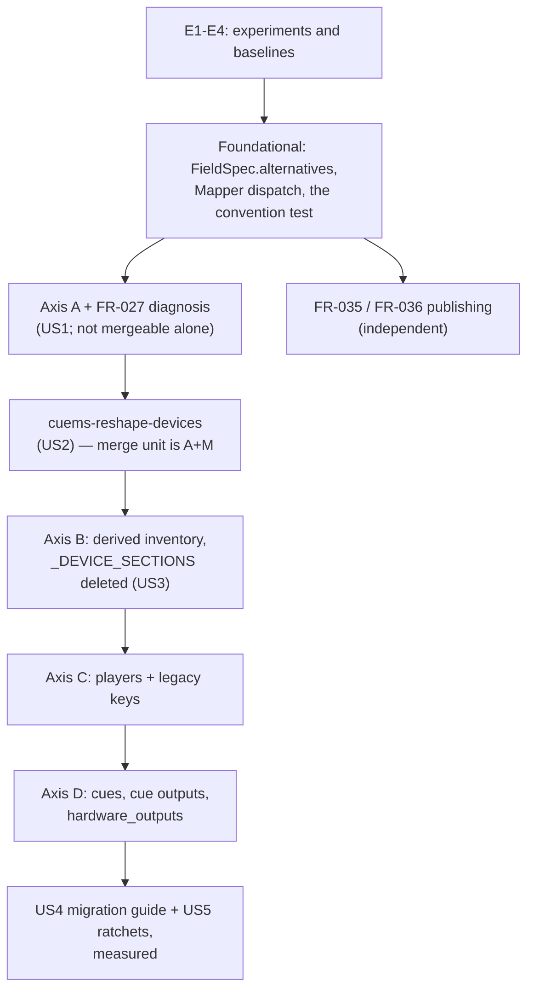

<!--
SPDX-FileCopyrightText: 2026 Stagelab Coop SCCL
SPDX-License-Identifier: GPL-3.0-or-later
-->

# Implementation Plan: device-class reshape

**Branch**: `013-device-class-reshape` | **Date**: 2026-10-01 | **Spec**: [spec.md](spec.md)
**Input**: Feature specification from `specs/013-device-class-reshape/spec.md`

## Summary

Adding a hardware device class to CUEMS currently costs edits in four schemas, several model classes,
two six-key literals and a handful of tests. This feature makes it cost **one line in one schema**, or
nothing at all when the class needs no special fields: each per-class element becomes one
class-carrying element inside a container, its type selected by XSD 1.1 conditional type assignment
(`xs:alternative test="@class='…'"`), and the library derives the class→type map from the schema
instead of naming classes in Python.

Four axes reshape — node device mappings and the root default pairs (A), the library's own enumeration
(B), the node settings player sections (C), and the show script's cue and cue-output choices plus
`hardware_outputs.xsd` (D). No document version step is taken: the old and new element shapes are
mutually exclusive under `xs:sequence`, so the shape *is* the marker, and a new one-shot entry point
`cuems-reshape-devices` migrates every document on disk. The per-class Python classes
(`AudioCue`, `VideoCue`, `DmxCue`, the three `*CueOutput`) all survive, selected by class rather than
by element name, so cue equality, hashing and `isinstance` dispatch do not change anywhere.

Two upstream findings close here as well: `partition_by_adoption` becomes publicly reachable
(FR-035), and a configuration document becomes publicly validatable without being loaded (FR-036).
The public call is `from cuemsutils.tools import validate_config_document`. The body lives in
`tools/config_validate.py`; the façade re-exports it lazily so importing another tools module
does not pull the schema stack.

## Decisions

**D1 — `node_mappings` class keys keep resolving.** `ConfigManager.node_mappings["audio"]` and
`["video"]`, and any other class the document carries, are derived from `devices`.
`NodeEngine.py:508` and `:598` use `.get(..., [])`; a missing key configures no ports and raises
nothing (M13). This is FR-012a and the second arm of A4. It is not a class list (FR-010). It is
the mappings-document form of the answer already given for `node_conf` player keys (FR-042).
Evidence: research R10.

## Technical Context

**Language/Version**: Python 3.11+ (3.11/3.12/3.13 supported; tests run under pyenv 3.11.9)
**Primary Dependencies**: `xmlschema==3.4.3` (pinned — XSD 1.1 is required for both `xs:assert` and
the `xs:alternative` this feature is built on), `lxml==6.1.0` (not in the XML write path), stdlib
`xml.etree.ElementTree` for the writer and every pre-validation probe. **No new dependency.**
**Storage**: XML documents on disk — `/etc/cuems/*.xml` and the project library resolved from
`settings.xml`; six bundled XSDs under `src/cuemsutils/xml/schemas/`
**Testing**: `pytest` + `pytest-cov` + `hypothesis`, through
`PYENV_VERSION=3.11.9 uvx hatch run test.py3.11:run -- -q` (`hatch` is not installed on this box, and
the `hatch test` env lacks `hypothesis`)
**Target Platform**: Debian bookworm nodes, shared venv `/usr/lib/cuems`, `.deb` built from
`debian/` on the working branch
**Project Type**: single Python library with CLI entry points
**Performance Goals**: mappings-document load ≤ 110% of this branch's pre-change measurement
(SC-PERF-001); suite ≤ 18.04 ms/test (SC-PERF-002); migration throughput on `remint_200` recorded
against a calibration of that same fixture — read and atomically rewrite, no device-class
substitution — written into `baseline.md` before the comparison (SC-PERF-003). **Every denominator
is measured before the first schema edit** — E4 in [quickstart.md](quickstart.md) — because a ratio
to an unmeasured baseline is not a budget. The calibration is that denominator for the tool; the
tool's own number is not the budget.
**Constraints**: no new runtime dependency; no library version bump (`0.1.0rc16`, pinned by
`tests/packaging/test_no_version_bump.py`); nothing ships from this branch alone (D27 — the
coordinated `xml-refactor-merge-candidate` tag comes after 011–014, `cuems-utils` last); feature 012's
identity surface untouched (A8)
**Scale/Scope**: four schemas, ~1 derivation-layer field, 1 new entry point, 2 published names; a
deployed cluster's `/etc/cuems` plus every project in its library; six consumer repositories told in
writing, four of them measured ([research.md](research.md) R7–R10)

**No NEEDS CLARIFICATION remains.** Two clarification sessions settled seven questions, including
the two the first session deferred; the one decision left to planning — FR-029, where the migration
tool lives — is answered in research R6.

## Constitution Check

*GATE: passed before Phase 0. Re-checked after Phase 1 at the end of this document.*

### I. Code Quality By Default

- **Gates**: `ruff check .`, the existing type and lint configuration, and SC-QUALITY-001 — no new
  warnings, and no new deprecation warnings beyond the 215 the baseline run reports.
- **This feature removes more code than it adds.** `_DEVICE_SECTIONS`, two six-key literals
  (`ConfigManager.py:159`, `:283`) and the per-class element declarations go; one `__missing__`, one
  `FieldSpec` field and one dispatch function arrive.
- **The rationale that must be written down**: the container elements exist for a non-obvious reason
  (research R2 — the converter discards a type's single children once a repeated one appears), and a
  future contributor will otherwise "simplify" them away. It is recorded in the schema comment, in
  [contracts/schema-conventions.md](contracts/schema-conventions.md) rule 4, and in
  [quickstart.md](quickstart.md) item 1.
- ✅ Pass.

### II. Tests As A Release Gate

- **Contract** (new): the `@class`/`xs:alternative` authoring convention; class uniqueness rejected;
  an unknown class decodes to the base model and is reported; FR-027's diagnosis asserted **on the
  message**, not the exception type; the migration tool's idempotence asserted **on bytes**;
  `partition_by_adoption` importable from a module containing no `cuemsutils.xml` import; per-schema
  deprecation advice for all six schemas.
- **Integration**: an old-shape installation migrated end to end — `/etc/cuems` plus a library of
  projects — then loaded; the three compatibility surfaces (`node_mappings["audio"]`, the three
  `node_conf` player keys, the six `default_*` keys) answering after the reshape.
- **Unit**: `FieldSpec.alternatives` derivation; `_alternative_for` fallback behaviour;
  `HardwareOutputs.__missing__` answering `[]` for a class and `KeyError` for a typo.
- **Ratchets that move in the same commit as the behaviour**: `CURRENT_SCHEMA_HASHES`,
  `KNOWN_IDENTICAL_DUPLICATES`, `test_mappings_shape.py:136-141` (which asserts the presence of the
  constant this feature deletes — it is a source-level ratchet and stays green while the behaviour is
  gone), and `spec._derive_attributes`' counting docstring.
- **Fail-before-pass is recorded** per SC-TEST-001, as features 008, 011 and 012 did.
- **One pre-work task is a test-data task**: `tests/data/corpus/pre-013/` snapshots an old-shape
  example of every reshaped document *before* any schema narrows, because afterwards none can be
  produced from this tree (R13).
- ✅ Pass.

### III. Consistent User Experience

- **Surfaces**: one new CLI (`cuems-reshape-devices`), one error message class (FR-027), two new
  public names, and the migration guide.
- **Conventions followed**: the CLI's `--check` / `--dry-run` / `<path>: <verdict>` output and its
  exit-code ladder mirror `cuems-init-node` and `cuems-convert-documents` rather than inventing a
  third style; the new validator reports through feature 008's existing
  `LoadReport`/`Outcome`/`RepairRecord` types rather than a second vocabulary; the backup is
  `convert_documents`' timestamped sidecar, byte for byte the same recipe.
- **FR-027 is the UX requirement with teeth**: an un-migrated document must not produce a bare
  `xs:sequence` "unexpected child" complaint. That is the X13 failure mode this repository vendors two
  broken settings files as evidence of, and it is why the diagnosis lands in the same commit as the
  first schema edit rather than at the end of the feature.
- ✅ Pass.

### IV. Performance Budgets Are Requirements

- Budgets are declared above and in SC-PERF-001–003, and **their denominators are measured first**
  (E4). Feature 012's lesson applies directly: two of its budgets were supplied by analysis and one
  was unreachable by construction, which is why this feature derives every bound from a sample on
  this machine rather than from a round number.
- Ranges, not single runs: `test_descriptor_laziness` moves passed/skipped totals by ±1 on an
  unmodified tree. Per-test time, never wall clock.
- **Any exceedance is recorded as exceeded with its mechanism identified** — never restated as
  passing. Features 006, 007, 008 and 012 each have an entry of this kind in their `baseline.md`.
- The plausible regression is identified in advance: one extra attribute read and one dict lookup per
  conditional element decode, against a decode already dominated by `xmlschema`.
- ✅ Pass.

## Project Structure

### Documentation (this feature)

```text
specs/013-device-class-reshape/
├── spec.md                          # requirements; 2 clarification sessions, 7 answers
├── plan.md                          # this file
├── research.md                      # Phase 0 — R1-R15 + experiments E1-E4
├── data-model.md                    # Phase 1 — the four document shapes, before and after
├── quickstart.md                    # Phase 1 — environment, the 4 experiments, 6 reverts
├── contracts/
│   ├── schema-conventions.md        # the 5 authoring rules; what a new class costs
│   ├── cli-reshape-devices.md       # the migration tool's contract
│   └── library-surface.md           # what moves, what is published, what does not move
├── checklists/requirements.md       # spec-quality checklist, iteration 3
├── baseline.md                      # written during implementation (E4 first)
├── migration-guide.md               # written during implementation (US4)
└── tasks.md                         # /speckit.tasks output — NOT created here
```

### Source code (repository root)

```text
src/cuemsutils/
├── xml/
│   ├── schemas/
│   │   ├── project_mappings.xsd     # axis A: <devices>/<device class>, <defaults>/<default>
│   │   ├── settings.xsd             # axis C: <players>/<player class>; audiomixer untouched
│   │   ├── script.xsd               # axis D: <Cue class>, <CueOutput class>
│   │   └── hardware_outputs.xsd     # axis D: per-class output lists
│   ├── spec.py                      # FieldSpec.alternatives; _derive_attributes docstring
│   ├── mapper.py                    # _alternative_for + dispatch in _decode_member; _tag_for_item
│   ├── validators.py                # the ("NodeMappingType", "video") rule target (R12)
│   ├── descriptor.py                # per-field repairability over the reshaped fields
│   ├── reshape_devices.py           # NEW — the migration tool (FR-029 / R6)
│   ├── make_defaults.py             # generates the 3 installed defaults; runs at .deb build time
│   └── seed_values.py               # TABLE_KEYS / V1-V2 over the reshaped types
├── tools/
│   ├── ConfigManager.py             # axis B: HardwareOutputs, derived; legacy keys derived
│   ├── NodeList.py                  # FR-035: re-export partition_by_adoption
│   ├── config_validate.py           # FR-036: validator body; consumers do not name this module
│   └── __init__.py                  # façade; lazy re-export of validate_config_document
└── defaults/system-defaults.toml    # seed keys for the reshaped types

tests/
├── contract/                        # the convention, uniqueness, FR-027's message, the ratchets
├── integration/                     # end-to-end migration; the compatibility surfaces; timing
├── unit/                            # derivation, dispatch, __missing__
└── data/corpus/pre-013/             # NEW — old-shape snapshots, taken before any schema narrows

debian/rules                         # :27-29 regenerates defaults through the built venv
pyproject.toml                       # [project.scripts] cuems-reshape-devices
```

**Structure decision**: unchanged. This is an existing single-package library; the feature adds two
modules (`reshape_devices.py`, `config_validate.py`), one corpus directory and one entry point, and
edits four schemas in place. `validate_config_document` is reached through `cuemsutils.tools`, not
by naming `config_validate`.

## Phases, and why the order is forced



- **E first.** E1 and E2 are the mechanism's go/no-go; E4 sets every performance denominator, and a
  denominator measured after the change is not a denominator.
- **The derivation and dispatch work precedes every schema edit**, because no reshaped schema can be
  read until it exists. There is no useful intermediate state in which a schema has narrowed and the
  engine cannot decode it.
- **Axis A's schema commit carries FR-027's diagnosis, not the tool.** From the moment the first
  schema narrows, every document on a deployed node is un-loadable, and the requirement is about
  what a maintainer sees at that moment. The tool is the next phase, because its axis A
  transformation is only testable once the schema has narrowed. **The merge unit is the two
  together.** Phase 3 alone diagnoses and does not migrate; do not merge it. A plan that deferred
  the diagnosis to a final phase would miss the point; a merge of the schema without the tool
  would too.
- **Axis B follows axis A** because the inventory is derived *from* the reshaped mappings document.
- **Axis D is last** and is independently cuttable: it is the only axis touching show scripts, it
  carries the whole wire-key change, and its `hardware_outputs` half is knowingly duplicated work
  (feature 014 replaces that schema's structure outright).
- **FR-035 and FR-036 are independent of all four axes** and can land in parallel or first; they are
  grouped last in the diagram only because they are small.

Phase 2 (`tasks.md`) is produced by `/speckit.tasks`, not here.

## Complexity Tracking

| Deviation | Why needed | Simpler alternative rejected because |
|---|---|---|
| **A third CLI entry point** (`cuems-reshape-devices`, joining `cuems-init-node` and `cuems-convert-documents`) | `convert_documents`' only discriminator is the version marker (`:76-79`, `if version >= current: return CURRENT`) and this migration moves no marker; its input is a path list, with no installation discovery | Extending `convert_documents` means a mode that bypasses its own gate and reimplements discovery inside it — more coupling than a module that reuses `library_reach` and the backup helper. Research R6. |
| **A second type-resolution mechanism in the derivation engine** — `FieldSpec.child` (static) plus `FieldSpec.alternatives` (per instance) | the engine resolves exactly one model class per element tag (R1); a class-carrying element has one tag and several types | Name-mangling `"video"` → `VideoDeviceType` is the mechanism `registry.py`'s own docstring records as having silently missed thirteen bindings. A Python-side table is the second declaration SC-002 exists to prevent. |
| **Container elements that exist in the XML and not in the model** (`<devices>`, `<players>`, `<defaults>`) | a type may not mix single element children with a repeated one — the converter replaces the accumulated dict with a list (`converter.py:144-148`, R2), silently losing `uuid` and `mac` from a node | Flattening the devices into `NodeMappingType` directly is the obvious design and produces a schema-valid document that decodes wrong. `OutputsType` is the existing precedent for the container shape. |
| **Axis D touches every show script in every project library** | the cue and cue-output choices are two of the four places a new class must be declared; leaving them is leaving the feature half-done | Deferring axis D is a live option and is sequenced last for exactly that reason — but then a new class still costs two schema edits, and SC-001 is not met. |
| **`hardware_outputs.xsd` is reshaped although feature 014 replaces it** | it is the fourth per-class enumeration, and SC-003 asserts no class name survives anywhere | Skipping it leaves a per-class declaration standing and a success criterion unmet for the sake of one small file; it is recorded as the cheapest item and the first to cut if the feature must shrink. |

## Post-design Constitution Check

Re-evaluated after Phase 1. **No new violation.** Four observations the design produced:

1. **Quality improved rather than traded** — the net change is a deletion of enumerations. The one
   addition with real subtlety (the containers) has its rationale recorded in three places because the
   obvious simplification of it is a silent data-loss bug.
2. **The test strategy gained a pre-work obligation** the Phase 0 check did not name: the
   `tests/data/corpus/pre-013/` snapshot must be taken before the first schema narrows. Recorded as a
   task, not left to be noticed.
3. **UX gained a hard commit boundary**: FR-027's diagnosis ships with the first schema edit. A plan
   that tidied it into a final "diagnostics" phase would satisfy the requirement's wording and miss
   its point.
4. **Performance gained a prerequisite**: E4 runs before any edit. SC-PERF-001 is a ratio, and
   nothing on this branch has measured its denominator yet.

FR-014's reporting mechanism is decided: one INFO log line that satisfies FR-UX-001 (schema,
document, path, offending class, and what to do). Not a `LoadReport` field — that signature is
pinned by `public_api.json` — and not a new public function. The wording is in
[tasks.md](tasks.md) and in FR-014.
